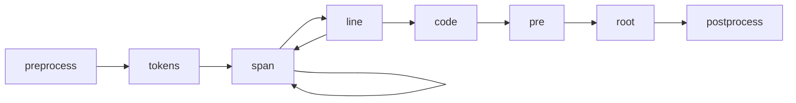

# Transformers

Shiki uses [`hast`](https://github.com/syntax-tree/hast), a AST format for HTML, to process the result and generate the HTML.

You can provide your own `transformers` to customize the generated HTML by manipulating the hast tree. You can pass custom functions to modify the tree for different types of nodes. For example:

```ts twoslash
import { codeToHtml } from 'shiki'

const code = await codeToHtml('foo\bar', {
  lang: 'js',
  theme: 'vitesse-light',
  transformers: [
    {
      code(node) {
        this.addClassToHast(node, 'language-js')
      },
      line(node, line) {
        node.properties['data-line'] = line
        if ([1, 3, 4].includes(line))
          this.addClassToHast(node, 'highlight')
      },
      span(node, line, col) {
        node.properties['data-token'] = `token:${line}:${col}`
      },
    },
  ]
})
```

We also provide some common transformers for you to use, see [`@shikijs/transformers`](/packages/transformers) and [`@shikijs/colorized-brackets`](/packages/colorized-brackets) for more details.

## Transformer Hooks



- `preprocess` - Called before the code is tokenized. You can use this to modify the code before it is tokenized.
- `tokens` - Called after the code is tokenized. You can use this to modify the tokens.
- `span` - Called for each `<span>` tag, for each token.
- `line` - Called for each line `<span>` tag.
- `code` - Called for each `<code>` tag, wraps all the lines.
- `pre` - Called for each `<pre>` tag, wraps the `<code>` tag.
- `root` - The root of HAST tree. Usually with only one child `<pre>` tag.
- `postprocess` - Called after the HTML is generated, get a chance to modify the final output. Will not be called in `codeToHast`.

## Meta

Transformers can also access markdown 'meta' strings in [supported integrations](/guide/install#integrations).

<!-- eslint-skip -->

````markdown
<!-- [!code word:meta=here] -->
```html foo=bar baz-qux="qu ux"
````

You can access the raw meta using:

<!-- eslint-skip -->

```ts
this.options.meta
// => { __raw: 'foo=bar baz-qux="qu ux"' }
```
