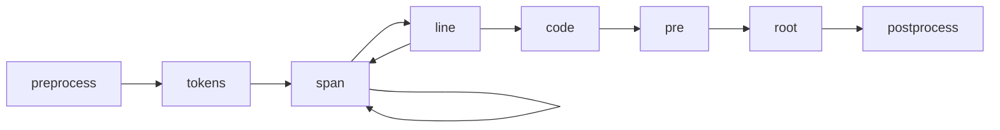

# Transformers

Shiki uses [`hast`](https://github.com/syntax-tree/hast), a AST format for HTML, to process the result and generate the HTML.

You can provide your own `transformers` to customize the generated HTML by manipulating the hast tree. You can pass custom functions to modify the tree for different types of nodes. For example:

```ts twoslash
// @twoslash-cache: {"v":1,"hash":"2f3a0f0b1f113723ce66b52900b7805f92ea1999e7bbc72ecaae001de7329769","data":"N4Igdg9gJgpgziAXAbVAFwJ4AcZJACwgDcYAnEAGhDRgA808AKAQwBsBLZuASgAIBjCGDhoB0GABUIACTQBbVol6NBsJSNLswAcwq8IWNOyFwlAYXFTpXNAHlDx4QB4AQgFcwUVjCgAZZjpuzNoweu6e3lAS+DByMAB8fAC88bwACqQQcuxwME4aWtrxADpg7HJYEKSiqpIy8qyUICLM1UgAnFTeOmj4SACMAAxUaK0hDIggtVYNTRxguIjDU/itzPw05IjtAL4U6NiLBMRkTTT0eILCNeLqaJo6TS1tiAAsAExdMD19byNjMAmU3Ecy0i0+KzWG1OiAAbHsDjg8IQSOQRnQgSwOFw+NN6goVLdeAUdHoDEYTOZLDIbPYKc5wl4fP5AsFQrxGZForEEtwlBksjk8iSiqVypVqmJYDMFE9Ri8AKwKr4/AbLeXjS7U2SyrpgpAQ/irUjrTYDXb7aiHZEnNHUDFMLCZHDVDB8VgBbRKYogABWcB9ctaEwAHP0VdpekhXv9SJrJh7HnqFkgAMxUI1Qs2Id4Iq1IyYo07oi6TRhOgxkTB8CywOmOOAAZUK3m5cVcHiZURicXiADpejylG2YAAlGDaHL3Zj0gCCYAwvAAPrxG/dCr52Js2ABVMpCDsRHwjvQi+JBl7tZUgbqR37XjWAvCDuKglN/SEm6FbXOWzAF45UTOB0ywrF1q14CQTWEAAzKo4lIesTAHaC4Dg0gELgAB+JRG3wdgAGt2CggI0PgshkAAXWXXhOxgGCwSgJooAgfgEEmEjYPI0g4F4dDeEHVd8KI3gsHYHB5hgPsLwmfp3nDG9vjvAYIUfIFpy4jCyAQZNFmvTMv2zX9ESOIs7XOTEwKrN0hMI4jUPQhC+1qHDlEYXoclw4T7NIxyyAsMALL0VYRCUABRbw4kC5JUginlApoogIHYKA+BXOiGIWJiqBYti8E4siMIEmJeAAAycWp4lK3gYEi740D7XhxzQNxSDAXhmF4BYAHdeAAOXEXhuvYVhWF4UgYCwD1+BgYrZqqdhJzANh9AWaSqGeWTXk6RTVQ/NStVgN9FgAdgzY1TRheE/2tQtbWA0sQHLNY4k2PhIDUXg4qihgNvlWSFRjXblP2gEgQ+3BdKQM7P0urZ+n6PN/1M+6S0s51rL4PC7IKvzSACiy+2YKAoDMD04DgKwbCURgQrQcK6sCvR+HJuA+uYOI7gebQaJFKiYq+xnfpAXL2JAHcjA4TABIgDqsBwTwBFZmWOt4OmuvEUpSgASRguayqs11nNZ6qclVkU9C3IaRrGgAjWa4CmrcaCgXhbcXR31lmgJXauVEXZVgIOtIE0MHW5p/oGE7r1vKNEH6IGDsmYnSdZqmRGOpAQ3OrMYX6VMkduwDi3tR7npNV6yHeolvvqmTzWWWPfkTsG8AhzPEGz2HvwNENC4AsyHvRytXSx7zce4vtJNcxh3Pw0xbKIietPxoQgrV6nBfitA9EkpQwDcOR7dIAXa4SlckpStLaM8ejGOY1ixeXuQavWfBeEksr8iwIOWa4OAkg+kkj6KqNUhbh1GNodiyBkAgB/hXJodMQCUQoLA+BHNjq8H6AAWltlwHwH8wRdUPsfZBKCI7BgNO8WEEY44tzjE+BM+oobx2WAZOGSBromRtEBNGjoXqAirhrT6Z9habQNKmBSTdoyxnjOAEELChg50MnnRGN0B6o1LpZARb1CELH3iQku4icyphhtI0GDCgSSQ7ko7u2Z+gnX7ijXhWj+EV0ESfYRMAGbb3rjmBU6ZgZ0NkYw+RR1FEKXYT3TuTieElwso6DGo8t4/T7IbIw8B+RJIyTpEWj88DazAHBDqFNWKcADsNXo+tarb3DsY94Cou7mNsUnOB2T2DwBsZEi60T86xLui4hJoEdFCL3sQo+RjI45hDEDcx9C5HWIicojhiBUwWm4QM+JIEnqvUIKlXgs4Q7MAwE4A+EzSD9i0CzNwsA4CMFyK0I0oiDHnL0DBTIchCmwFoK5M5x8+RuwgBAbwAQH55UmAAEQ8dkBYvFuoxEHKQDq7VWih14Fc1gNz4CqxmtUZgWgwHbz0BNFqbVCgCVIG4eaSKYJsFyCUuWYFNAzikmcYI0C0EvSeDAR5+BRGQRKjUn6KsHmkCNHxKo0kUGcoQVQd5WQvl0AFbNSocAtyOHRe1DyvFUXHI6qIeF7BxVoFlvbJaxIeVivwjoCVSLRVPPAWQv6lDVkI1ob8LurSMVYtydY+OhoelGWMvmZxWyy7oMrp4sZfzJkutTO8RuSlgnUFbkwlMiiA25y2JI/pxdzLbPLNkmy2Ml4OW4gTDERMSZk3/unemyg6Y+J+szVm7NObEnXDalcfNKKnyFmCsWEsRpbkXCaxl3xfbKzHZ1dWEMtZgF1vrUq6Sw5/wpqbHVHbuaWwNTbN2DsnZoADu7YkP8ZrIt9kIf2BDp0oqOWHPxqYPjuoGPM0JKca0UzrTYwJUT7EKlzYPPhwz3G6Ihk2uuzqXipgVGYpNzcQngwUTefU8df2BphKmQYgHNFDKeiuseOMy0rz7J7MAM856eUXj5TSCEK30GCpvURu8wQvOPszYFbGyAsYWM8lJ9U9AmoIt8YcPZjwQGE2APt29ErJX2elW+mUfADvysRl+PLjUSe+F/MjoChX1TqVMtZUj4MyJTZYvAZGbH6Qw1sLhIa4n5vDSMzx4H+OBUfe0GhQSEPmbke3RRNms0DDURsvNQ83Ecw8e6Vj4zSFQYmK8QYEI5mIbwIslD75+hBZUfDRx6jQ1Oe0aBoRghFBxdjS8JLTTTOrLS5MMr1nlnRPeAXArjmIsgai2Bmu/aEvRlay+ix/nkN+v6N5v9MI+7tc2UVxJI8IKiLSe0zJ6QVu5NFgUopst/5lJZa7Sp79BL6cCoZl1Hwat7RaamtpC2Om+tQ+N5r9i2thaA64rrkaYv6Iq3aYxrxYSzNq2+qxzDMuLCe3YmE20cODILRG6LYhysxr+1M14J0Uu1cCa0xriiJu2aQLBnY5Dah4HFFUUQwApR1B1GNHYfEPm8AAORwG8kz+dVwRDU94EkDq3V8U3GlPiVgjAmdwQgMUYoeDSBM70MAUovAP6eiUEz/0suFdzXbUzogW54C5GwRwbQ+A0Dq/ahS3y3EF7IA14r+XZvFeK9qIwCGfA7cO/d8VHIVbU61ppCIZ34g9BM8TNoIIIRsFq+4Dbh3exo+K8kgH2APGYCu7jw7iGy27vwGQEzqAM5mAG7BEz6ivPgH249+wPWjBkDhl4OmXgrxKJ9m9bcxgkluBR/Lx7z3cBvefspn7tAif2RM/wkbw3xumed+77Hrvp6AjD+Txx1gqe5+K4z+k+7Oe8+jGwUJ74xeedlX32ARAAASYAkkdjn+AGVnYpU0+z/d0/3glFSg7G4E0V6zAkCgAxN8NVIQZ8BAHYHYIAA=="}
import { codeToHtml } from 'shiki'

const code = await codeToHtml('foo\bar', {
  lang: 'js',
  theme: 'vitesse-light',
  transformers: [
    {
      code(node) {
        this.addClassToHast(node, 'language-js')
      },
      line(node, line) {
        node.properties['data-line'] = line
        if ([1, 3, 4].includes(line))
          this.addClassToHast(node, 'highlight')
      },
      span(node, line, col) {
        node.properties['data-token'] = `token:${line}:${col}`
      },
    },
  ]
})
```

We also provide some common transformers for you to use, see [`@shikijs/transformers`](/packages/transformers) and [`@shikijs/colorized-brackets`](/packages/colorized-brackets) for more details.

## Transformer Hooks



- `preprocess` - Called before the code is tokenized. You can use this to modify the code before it is tokenized.
- `tokens` - Called after the code is tokenized. You can use this to modify the tokens.
- `span` - Called for each `<span>` tag, for each token.
- `line` - Called for each line `<span>` tag.
- `code` - Called for each `<code>` tag, wraps all the lines.
- `pre` - Called for each `<pre>` tag, wraps the `<code>` tag.
- `root` - The root of HAST tree. Usually with only one child `<pre>` tag.
- `postprocess` - Called after the HTML is generated, get a chance to modify the final output. Will not be called in `codeToHast`.

## Meta

Transformers can also access markdown 'meta' strings in [supported integrations](/guide/install#integrations).

<!-- eslint-skip -->

````markdown
<!-- [!code word:meta=here] -->
```html foo=bar baz-qux="qu ux"
````

You can access the raw meta using:

<!-- eslint-skip -->

```ts
this.options.meta
// => { __raw: 'foo=bar baz-qux="qu ux"' }
```

## Enforcing Transformer Ordering

For compatibility or fine-grained control, it may be necessary to enforce the order of a Shiki transformer. You can control the position of a transformer with the `enforce` modifier:

- `pre`: invoked before normal transformers
- default: invoked as a normal transformers
- `post`: invoked after normal transformers

Example:

```ts twoslash
// @twoslash-cache: {"v":1,"hash":"8d7b272af17166c83782bdb0d9e41de0f75c878526f69245c6e6021e1a4bfa45","data":"N4Igdg9gJgpgziAXAbVAFwJ4AcZJACwgDcYAnEAGhDRgA808AKAQwBsBLZuASgAJ2wNUgDNmAYxi8AyvnYBrdgBVSzMHGERSAWzIAdMOy1ZNaabIXLV6zTvJU4aZqQaIAjABYqrGGADmafCRXADYqR1JfGBcQGXklFTUNbTJKEA4wXEQABioxfCdxISD3AF8KdGxMgmIUsLposQg1UzEAVwcILUtEmzJEMzju62S7EAcnFwBWAGYvH39AtwB2MKdIhva0TqGk21T0zIAmXPyVMSLEYLKKnDxCElGaeiY2Th5+QTJRCQGLBOHbPpDMZnL94lZdrUxuEXEtjml5gEgqFqGsonhYn8Ib1RgckPC8gVzilEIdJtdqJU7jVHvUmFhSBAcM4MHxMeCeiMAHRgZg6AD8/QcpAEvl4AB9eK0wLBhAIYFBUlAIGIEIgQAA5PmSCDCXgBSRof6Q0bjZxIACckzmfiRiE8qIi6PVvJ0+3lSFmIEJZwuhwpmFu6vuUKe0UYDKZZEwbPMHIBZC5PiSEkFvF0IAZMAzEvTmYgDhzkulsvliqoytVeAAomAU5IsKxWr4BB8iCrmGh2E19ewyLw4IZ2KwnPqILwAO4wABGWHEcl4rAgzFgpDgXN4AAkIBA5HBeJpV6KgfuHMPWAPWtOAFYwc5j/X4SQAA0PZGfvEjzMwH0fkkIu4Hjed5oFy+j6AACk2LZgG2HZdj2b6kIg+gALS8M+yaaBI/QAORZrhH6Ns2AhwGhvCQNobCftBpHkZhdbYTAeHGA4hE0SRajkXAcafgWpjETBCD2DCQSHK4NoLEgKyOuseBYaQEjuhkSAOj6hQkv65SUkG1QPKkYb0oy36smCOw4lyjSwGmjCMAE7BwP07LmSMADCTRhhQvD5A4/TVt4OiCHwAC8AB8vD+TAgWmJK7bsFAfDFjKMByhk5YgJWaogC5Wh/hhAA8VkwKFH4wAFPigbwABKUStKQsHMBRMATrwGrQJIE7nrwpAwI24iGk+B4ijB1FNDAXKpGaLiuNMFqSXaDrhHJ6pFcpmTWt6pwaeQpIBlSwY0gZdLqhGBQ6EIfCQLAfnlYIk2iW47gOt4tqLItaLRFduBeB6iAbepxI7UsJQALq5O1eDAiY+qVLwwBmcaOK8CUvDCIyuW4TxcS4eBYCNM0vBtB0XSIyMTlxjl/bBXD+i8BR2p4VoGCoUa2IjLhFC07wCk4bw+E9RzXNFYwX18MAXN0wA9JLvBcnLXNlPoJSpOdzBIKA9Q+IOTR4GgCAlCUQA==="}
import type { ShikiTransformer } from 'shiki'

const customTransformer: ShikiTransformer = {
  name: 'my-transformer',
  enforce: 'pre',
  code(node) {
    // ...
  },
}
```
